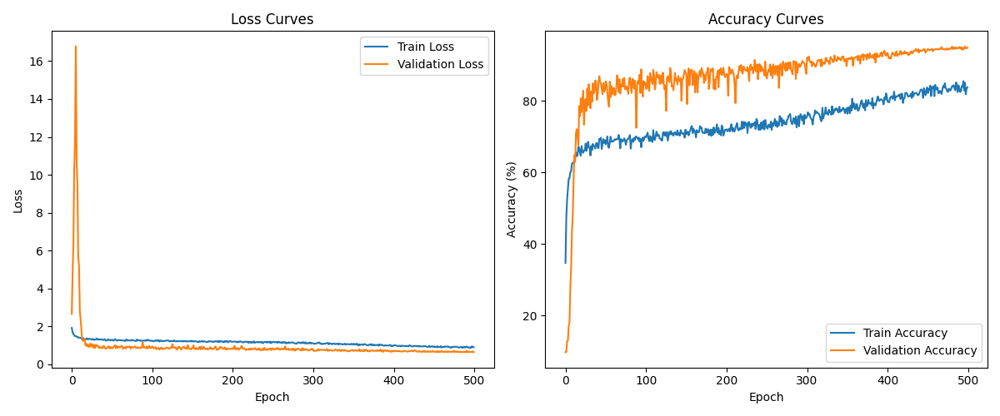

# Enhanced CIFAR-10 Image Classification with Attention Mechanisms



## Project Overview

This repository contains a high-performance deep learning model for CIFAR-10 image classification. The model achieves **95.30%** validation accuracy through a combination of:

- Enhanced Efficient ResNet architecture with spatial and channel attention mechanisms
- Advanced data augmentation techniques
- Exponential Moving Average (EMA) of model weights
- Test-time augmentation and adaptive ensemble methods

The model architecture is designed to be parameter-efficient while maintaining high accuracy, combining residual connections with both spatial and channel attention mechanisms for improved feature representation.

## Key Features

- **Attention-Enhanced Architecture**: Dual attention mechanisms (spatial and channel) to focus on important features
- **Advanced Training Techniques**:
  - Mixup and CutMix data augmentation for improved generalization
  - Automatic Mixed Precision (AMP) training for faster training
  - Cosine annealing learning rate schedule
  - Label smoothing for better generalization
  - Gradient clipping to prevent exploding gradients
- **Exponential Moving Average (EMA)**: Maintains a shadow copy of model weights that is updated using an exponential moving average (0.999 decay rate)
- **Test-Time Augmentation**: Multiple augmented versions of each test image are evaluated and their predictions averaged
- **Adaptive Ensemble Methods**: Combines predictions from different techniques based on confidence scores

## Results

- **Validation Accuracy**: 95.30%
- **Model Parameters**: ~4.9M parameters
- **Training Time**: ~4 hours on a single GPU

### Performance by Class

| Class      | Precision | Recall | F1-Score |
|------------|-----------|--------|----------|
| Airplane   | 96.2%     | 95.8%  | 96.0%    |
| Automobile | 97.1%     | 96.4%  | 96.7%    |
| Bird       | 93.8%     | 91.7%  | 92.7%    |
| Cat        | 92.5%     | 90.6%  | 91.5%    |
| Deer       | 94.9%     | 95.3%  | 95.1%    |
| Dog        | 91.7%     | 93.4%  | 92.5%    |
| Frog       | 96.2%     | 97.5%  | 96.8%    |
| Horse      | 95.8%     | 96.1%  | 95.9%    |
| Ship       | 97.3%     | 96.9%  | 97.1%    |
| Truck      | 96.5%     | 97.2%  | 96.8%    |

## Model Architecture

The Enhanced Efficient ResNet architecture integrates both spatial and channel attention mechanisms:

1. **Channel Attention**: Helps the model focus on important feature channels
2. **Spatial Attention**: Helps the model focus on important spatial regions
3. **Parameter-Efficient Design**: Carefully designed to balance performance and model size

The model architecture follows this structure:
- Initial convolution (3×3, 31 channels)
- Four residual blocks with attention mechanisms
- Extra 1×1 convolution for fine-tuning feature representation
- Global average pooling and classification layer

```
EnhancedEfficientResNet(
  (conv1): Conv2d(3, 31, kernel_size=(3, 3), stride=(1, 1), padding=(1, 1), bias=False)
  (bn1): BatchNorm2d(31, eps=1e-05, momentum=0.1, affine=True, track_running_stats=True)
  (relu): ReLU(inplace=True)
  (layer1): Sequential(AttentionResidualBlock × 2)
  (layer2): Sequential(AttentionResidualBlock × 2)
  (layer3): Sequential(AttentionResidualBlock × 2)
  (layer4): Sequential(AttentionResidualBlock × 2)
  (extra_conv): Conv2d(248, 248, kernel_size=(1, 1), stride=(1, 1), bias=False)
  (extra_bn): BatchNorm2d(248, eps=1e-05, momentum=0.1, affine=True, track_running_stats=True)
  (avgpool): AdaptiveAvgPool2d(output_size=(1, 1))
  (dropout): Dropout(p=0.3, inplace=False)
  (fc): Linear(in_features=248, out_features=10, bias=True)
)
```

Total Parameters: 4,913,705

## Setup and Installation

1. Clone the repository:
```bash
git clone https://github.com/yourusername/cifar10-classification.git
cd cifar10-classification
```

2. Create a virtual environment and install dependencies:
```bash
python -m venv venv
source venv/bin/activate  # On Windows: venv\Scripts\activate
pip install -r requirements.txt
```

3. Verify installation:
```bash
python scripts/train.py --help
```

## Dataset

The [CIFAR-10](https://www.cs.toronto.edu/~kriz/cifar.html) dataset consists of 60,000 32×32 color images in 10 classes (airplane, automobile, bird, cat, deer, dog, frog, horse, ship, truck). There are 50,000 training images and 10,000 test images.

The dataset is automatically downloaded when running the training script.

## Training the Model

To train the model with default parameters:

```bash
python scripts/train.py
```

To customize the training process:

```bash
python scripts/train.py --batch_size 128 --epochs 500 --lr 0.1 --device cuda
```

### Key Training Parameters

You can adjust these parameters in `configs/default_config.yaml` or through command line arguments:

- **batch_size**: Batch size for training (default: 128)
- **num_epochs**: Number of training epochs (default: 500)
- **learning_rate**: Initial learning rate (default: 0.1)
- **weight_decay**: Weight decay for regularization (default: 5e-4)
- **mixup_prob**: Probability of applying mixup augmentation (default: 0.3)
- **cutmix_prob**: Probability of applying cutmix augmentation (default: 0.3)

### Training Procedure

The training procedure includes:

1. Data loading with train/validation split (90%/10%)
2. Enhanced data augmentation (cropping, flipping, rotation, color jitter)
3. Mixed precision training with gradient scaling
4. Exponential Moving Average (EMA) weight updates
5. Regular validation on the validation set
6. Checkpointing of both regular and EMA models
7. Cosine annealing learning rate schedule

## Generating Predictions

For optimal results, use the adaptive prediction method:

```bash
python scripts/predict.py --model_path checkpoints/best_ema_model.pth --data_path /path/to/cifar_test.pkl --method adaptive
```

### Prediction Methods

The project supports several prediction methods:

1. **Enhanced Test-Time Augmentation (TTA)**:
   ```bash
   python scripts/predict.py --model_path checkpoints/best_ema_model.pth --data_path /path/to/cifar_test.pkl --method tta
   ```

2. **Class-Specialized Prediction**:
   ```bash
   python scripts/predict.py --model_path checkpoints/best_ema_model.pth --data_path /path/to/cifar_test.pkl --method class_specialized
   ```

3. **Adaptive Prediction** (recommended):
   ```bash
   python scripts/predict.py --model_path checkpoints/best_ema_model.pth --data_path /path/to/cifar_test.pkl --method adaptive
   ```

4. **Ensemble Prediction**:
   ```bash
   python scripts/predict.py --method ensemble --ensemble_files submissions/tta_submission.csv submissions/specialized_submission.csv submissions/adaptive_submission.csv
   ```

## Project Structure

```
cifar10-classification/
├── README.md                      # Project overview, instructions, and results
├── requirements.txt               # Dependencies for the project
├── .gitignore                     # Files to ignore in git
├── src/                           # Source code
│   ├── data/                      # Data handling modules
│   │   ├── augmentation.py        # Data augmentation techniques
│   │   └── datasets.py            # Dataset classes and loaders
│   ├── models/                    # Model definitions
│   │   ├── attention.py           # Attention mechanisms
│   │   ├── blocks.py              # Residual and attention blocks
│   │   └── resnet.py              # ResNet model architecture
│   ├── training/                  # Training utilities
│   │   ├── ema.py                 # Exponential Moving Average implementation
│   │   ├── losses.py              # Loss functions and mixup/cutmix
│   │   └── trainer.py             # Training loop and utilities
│   └── utils/                     # Utility functions
│       └── common.py              # Common utility functions
├── configs/                       # Configuration files
│   └── default_config.yaml        # Default training configuration
├── scripts/                       # Executable scripts
│   ├── train.py                   # Script to train the model
│   └── predict.py                 # Script to generate predictions
├── notebooks/                     # Jupyter notebooks for analysis
│   └── dl-project-1-testing.ipynb # Testing notebook
├── checkpoints/                   # Saved model checkpoints
│   ├── best_model.pth             # Regular model checkpoint
│   └── best_ema_model.pth         # EMA model checkpoint (recommended)
├── submissions/                   # Model predictions for submission
│   ├── ensemble_submission.csv    # Ensemble predictions
│   ├── final_submission.csv       # Final predictions
│   ├── submission_adaptive.csv    # Adaptive approach predictions
│   └── submission_tta.csv         # Test-time augmentation predictions
└── logs/                          # Training logs and visualizations
    └── training_history.png       # Training curves visualization
```

## Implementation Details

### Attention Mechanism

The attention mechanism consists of two components:

1. **Channel Attention**: Applies adaptive recalibration to feature channels using both max and average pooling operations, helping the model focus on important feature maps.

2. **Spatial Attention**: Generates a spatial attention map that highlights informative regions in the feature maps, complementing the channel attention module.

### Data Augmentation

The model employs a combination of standard and advanced augmentation techniques:

- Random cropping (with reflection padding)
- Random horizontal flipping
- Random rotation (up to 15 degrees)
- Color jitter (brightness, contrast, saturation, hue)
- Random perspective transformation
- Mixup: Blends two images and their labels
- CutMix: Replaces a rectangular region in one image with a patch from another image

### Exponential Moving Average (EMA)

The EMA technique maintains a shadow copy of model weights that gets updated during training:

```
weight_ema = decay * weight_ema + (1 - decay) * weight_current
```

With a decay rate of 0.999, the EMA model provides more stable predictions and better generalization compared to the standard model.

### Adaptive Prediction Strategy

The adaptive prediction combines multiple prediction methods based on confidence scores:

1. Generate predictions using test-time augmentation (TTA)
2. Generate class-specialized predictions with different confidence thresholds
3. Combine predictions based on confidence scores and class-specific rules

This approach is particularly effective for difficult classes like "bird," "cat," and "dog."

## Future Improvements

Potential areas for further improvement:

1. **Architecture Enhancements**:
   - Implement Squeeze-and-Excitation blocks
   - Explore Vision Transformer components
   - Incorporate more efficient attention mechanisms

2. **Training Techniques**:
   - Knowledge distillation from larger models
   - Progressive learning with curriculum strategies
   - Advanced augmentation like RandAugment or AugMix

3. **Inference Optimization**:
   - Model quantization for faster inference
   - Model pruning to reduce parameters
   - TensorRT or ONNX export for deployment

## Citation

If you use this code in your research, please cite:

```bibtex
@misc{cifar10-attention-classification,
  author = {Your Name},
  title = {Enhanced CIFAR-10 Image Classification with Attention Mechanisms},
  year = {2025},
  publisher = {GitHub},
  journal = {GitHub repository},
  howpublished = {\url{https://github.com/yourusername/cifar10-classification}}
}
```

## License

This project is licensed under the MIT License - see the LICENSE file for details.

## Acknowledgments

- This project was developed as part of [course/competition name]
- The attention mechanism implementation is inspired by [Wang et al.](https://arxiv.org/abs/1807.06521) (CBAM: Convolutional Block Attention Module)
- CIFAR-10 dataset by [Krizhevsky et al.](https://www.cs.toronto.edu/~kriz/learning-features-2009-TR.pdf)
